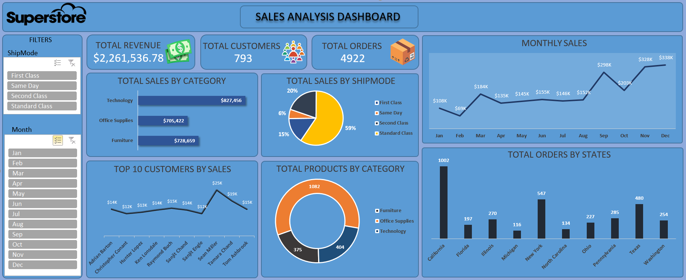

# Superstore Sales Analysis Dashboard

An interactive **Sales Analysis Dashboard** built using the Superstore dataset to analyze sales performance, customers, orders, products, shipping modes, and regional/state-level trends.

The dashboard provides a centralized view of key business KPIs and helps identify sales trends and customer/product performance.

---

## Dashboard Preview

---

## About the Project

The **Superstore Sales Analysis Dashboard** is a data visualization and business intelligence project created to analyze sales data and generate meaningful business insights.

The dashboard focuses on:

- Overall revenue and order performance
- Customer analysis
- Product category performance
- Shipping mode distribution
- Monthly sales trends
- Top customers by sales
- Orders by state

The goal of this project is to transform raw sales data into an easy-to-understand interactive dashboard that can support business decision-making.

---

## Project Objectives

The main objectives of this project are:

- Analyze overall sales performance
- Track revenue and order KPIs
- Identify high-performing product categories
- Understand customer purchasing behavior
- Analyze sales trends across months
- Compare different shipping modes
- Identify states with the highest number of orders
- Find the top customers based on sales
- Create an interactive and visually appealing business dashboard

---

## 📊 Key KPIs

| KPI | Value |
|---|---:|
| 💰 Total Revenue | **$2,261,536.78** |
| 👥 Total Customers | **793** |
| 📦 Total Orders | **4,922** |

---

## Dashboard Features

### 1. Total Revenue
Displays the overall revenue generated from the sales dataset.

### 2. Total Customers
Shows the total number of unique customers included in the analysis.

### 3. Total Orders
Displays the total number of orders recorded.

### 4. Total Sales by Category

The dashboard compares sales across three major product categories:

- Technology
- Furniture
- Office Supplies

Technology generates the highest sales among the three categories.

### 5. Total Sales by Ship Mode

Sales are analyzed across:

- Standard Class
- Second Class
- First Class
- Same Day

This provides an overview of customer shipping preferences and their contribution to sales.

### 6. Monthly Sales Analysis

The monthly sales trend helps identify:

- High-performing months
- Low-performing months
- Seasonal patterns
- Changes in sales throughout the year

### 7. Top 10 Customers by Sales

The dashboard identifies the top customers based on their total sales contribution.

This can help businesses understand their most valuable customers.

### 8. Total Products by Category

A donut chart shows the distribution of products across:

- Furniture
- Office Supplies
- Technology

### 9. Orders by State

The dashboard compares the number of orders across selected states and highlights regions with higher order volumes.

---
## Key Insights

Some notable observations from the dashboard include:

- **Technology** is the highest-performing sales category.
- **Standard Class** is the most commonly used shipping mode.
- **September, November, and December** show strong monthly sales performance.
- **California** has the highest number of orders among the displayed states.
- A relatively small group of customers contributes significantly to overall sales.
- Product distribution varies considerably across the three major categories.

> These insights can be further explored by interacting with the dashboard filters.

---

## Interactive Filters

The dashboard includes filters that allow users to analyze the data dynamically.

### Ship Mode

Users can filter the dashboard by:

- First Class
- Same Day
- Second Class
- Standard Class

### Month

Users can filter the analysis by individual months from **January to December**.

These filters allow users to drill down into specific segments of the sales data.

---

## 🛠️ Tools & Technologies

This project was created using:

- **Microsoft Excel**
- **Pivot Tables**
- **Pivot Charts**
- **Slicers**
- **Data Visualization**
- **Dashboard Design**
- **Superstore Dataset**

---

## 💡 Business Questions Answered

This dashboard helps answer questions such as:

- What is the total revenue generated?
- How many customers and orders are there?
- Which product category generates the highest sales?
- Which shipping mode is most commonly used?
- How does sales performance change month by month?
- Who are the top customers by sales?
- Which category contains the most products?
- Which states generate the highest number of orders?

---
